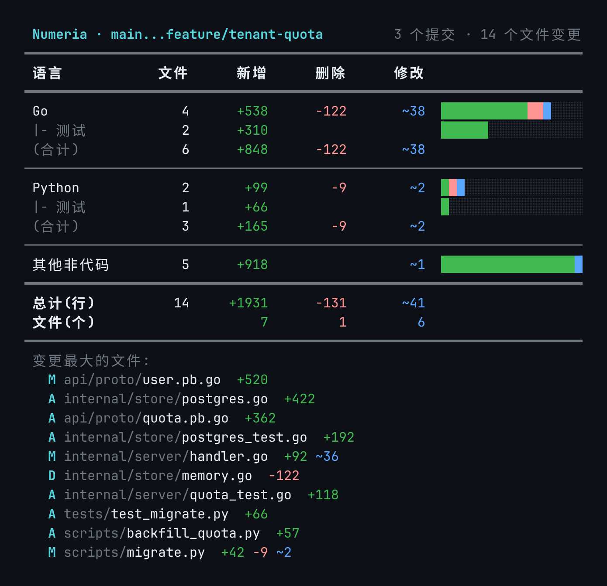

# Numeria

[](https://github.com/omeyang/Numeria/actions/workflows/release.yml)
[](https://github.com/omeyang/Numeria/releases/latest)

名字来自古罗马女神 **Numeria**:奥古斯丁《上帝之城》第四卷第 11 章转述罗马人的众神分工,「Numeria, quae numerare doceat」,即教人计数的女神。借用这一典故,为一次 git 变更逐行归类、计数、记账。[典故来源:Augustinus, *De civitate Dei* IV.11(拉丁原文)](https://www.thelatinlibrary.com/augustine/civ4.shtml)

按维度统计 git 变更:**代码 / 测试代码 / 其他非代码 / 文件**,各输出 新增·删除·修改(为 0 的项不显示)。只保证 Go 与 Python 两种语言的识别。零依赖单二进制(纯 Rust 标准库),装上即是 `git numeria` 子命令。



```
 Numeria · main...feature                       2 个提交 · 7 个文件变更
━━━━━━━━━━━━━━━━━━━━━━━━━━━━━━━━━━━━━━━━━━━━━━━━━━━━━━━━━━━━━━━━━━━━━━━
 语言            文件      新增      删除      修改
━━━━━━━━━━━━━━━━━━━━━━━━━━━━━━━━━━━━━━━━━━━━━━━━━━━━━━━━━━━━━━━━━━━━━━━
 Go                 2        +7                  ~1  ██████████████████
───────────────────────────────────────────────────────────────────────
 Python             1                  -1            ██░░░░░░░░░░░░░░░░
 |- 测试            1        +3                      ███████░░░░░░░░░░░
 (合计)             2        +3        -1
───────────────────────────────────────────────────────────────────────
 其他非代码         3        +1        -3        ~1  ███████████░░░░░░░
━━━━━━━━━━━━━━━━━━━━━━━━━━━━━━━━━━━━━━━━━━━━━━━━━━━━━━━━━━━━━━━━━━━━━━━
 总计(行)           7       +11        -4        ~2
 文件(个)                     2         1         4
━━━━━━━━━━━━━━━━━━━━━━━━━━━━━━━━━━━━━━━━━━━━━━━━━━━━━━━━━━━━━━━━━━━━━━━
```

tokei 式语言分类布局:每语言一组,测试代码以 `|-` 子行挂在所属语言下,附文件数列;为 0 的格留空。真彩色数字(绿新增/红删除/蓝修改)+ 纯色比例条带暗色轨道(段序固定、数字直标,色盲亦可辨);无真彩色能力的终端自动退回 8 色,尊重 `NO_COLOR`。

## 安装

零依赖单二进制,文件名 `git-numeria`。git 会把 PATH 里的 `git-<名字>` 自动识别为 `git <名字>` 子命令,所以放进 PATH 即是 `git numeria`,无需任何配置(`git-` 前缀就是这套机制本身,请勿重命名)。运行时只需要系统里有 `git`。

**一键安装**(Linux x86_64/arm64、macOS Intel/Apple Silicon;root 装到 `/usr/local/bin`,普通用户装到 `~/.local/bin`,连同 man 页):

```sh
curl -fsSL https://raw.githubusercontent.com/omeyang/Numeria/main/install.sh | sh
```

固定版本或自定义目录:`NUMERIA_VERSION=v0.0.1 NUMERIA_INSTALL_DIR=/opt/bin curl ... | sh`。

**手动安装**:从 [Releases](https://github.com/omeyang/Numeria/releases) 下载 `git-numeria-<tag>-<target>` 压缩包(Windows 用 zip),解压后把 `git-numeria` 放入 PATH,`git-numeria.1` 放入 `man1` 目录。以 Linux x86_64 为例:

```sh
V=v0.0.1; T=x86_64-unknown-linux-gnu
curl -fsSL -o /tmp/numeria.tar.gz "https://github.com/omeyang/Numeria/releases/download/$V/git-numeria-$V-$T.tar.gz"
tar xzf /tmp/numeria.tar.gz -C /tmp
install -m 755 "/tmp/git-numeria-$V-$T/git-numeria" /usr/local/bin/
install -Dm 644 "/tmp/git-numeria-$V-$T/git-numeria.1" /usr/local/share/man/man1/git-numeria.1
```

离线机器把压缩包拷过去按同样步骤安装即可。

**源码编译**(需要 Rust 工具链;Linux 产物要求 glibc ≥ 2.39,Rocky/RHEL 9、Ubuntu 22.04 等老发行版请用此方式):

```sh
cargo install --git https://github.com/omeyang/Numeria
```

**验证**:`git numeria --version`,`git help numeria`。Rocky Linux 10.2 完整示例、升级卸载与常见问题见 Wiki [安装](https://github.com/omeyang/Numeria/wiki/安装)。

## 用法

```sh
git numeria main feature          # 两分支比较(merge-base 三点语法 main...feature)
git numeria HEAD~5                # 最近 5 个提交
git numeria -n 5                  # 同上
git numeria v1.0..v2.0            # 显式范围原样透传
git numeria                       # 工作区 vs HEAD
git numeria main feature -v       # 附加变更最大文件 Top 10
git numeria main feature --html report.html   # 生成自包含 HTML 报告(浅/深双主题)
git numeria -C /path/to/repo -n 10            # 指定仓库
```

flag 可写在位置参数之后,`-html` / `--html`、`-flag=value` 均可。

## 维度划分

| 维度 | 规则 |
|---|---|
| 代码 | `*.go`、`*.py`(排除下述测试与生成代码) |
| 测试代码 | `*_test.go`;`test_*.py`、`*_test.py`、`conftest.py`、`test(s)/` 目录下的 `.py` |
| 其他非代码 | 其余全部,含 `vendor/`、`node_modules/`、`*.pb.go`、`*_pb2*.py` 等生成代码 |
| 文件 | 新增(A)/删除(D)/修改(M·R·T) 的文件个数 |

## "修改行"的定义

git 原生 diff 只有新增/删除两种行。本工具用 `git diff -U0 -M` 逐 hunk 配对:
同一 hunk 内 `min(删除行数, 新增行数)` 计为**修改**,余量计为纯新增/纯删除。
重命名(-M)按新路径归类;二进制文件只计入文件维度。

## HTML 报告

`--html` 生成自包含单文件报告:总览瓷贴、跨维度可比的比例条、按语言明细、文件明细表,浅色/深色主题自适应。配色经色觉缺陷(CVD)校验——"修改"用蓝色(VS Code diff 惯例)而非黄色,黄↔红在绿色盲下不可分。

## 开发

```sh
cargo test                        # 单元测试 + 端到端测试(构造真实 git 仓库比对)
cargo clippy --all-targets -- -D warnings
cargo build --release             # ~450KB 单二进制(strip + LTO)
```

## License

MIT
